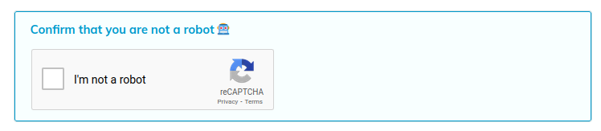

# Cloud CAPTCHAs Plugin

This plugin replaces the built-in CAPTCHA with Google's reCAPTCHA v2 or hCaptcha.

This plugin also serves as an example for developers who want to use a different
CAPTCHA for their Indico instance.

## Setup

The plugin requires you to set the site key and secret key on the plugin settings page.

When using reCaptcha these keys can be created on the [reCAPTCHA admin dashboard][recaptcha-create].
Choose **reCAPTCHA v2** and **"I'm not a robot" Checkbox**.

When using hCaptcha the keys can be created on the [hCaptcha dashboard][hcaptcha-dashboard].

## Changelog

### 3.3.2

- Update translations

### 3.3.1

- Update translations

### 3.3

- Support (and require) Python 3.12

### 3.2.1

- Support Python 3.11

### 3.2

- Initial release for Indico 3.2

[recaptcha-create]: https://www.google.com/recaptcha/admin/create
[hcaptcha-dashboard]: https://dashboard.hcaptcha.com/overview
