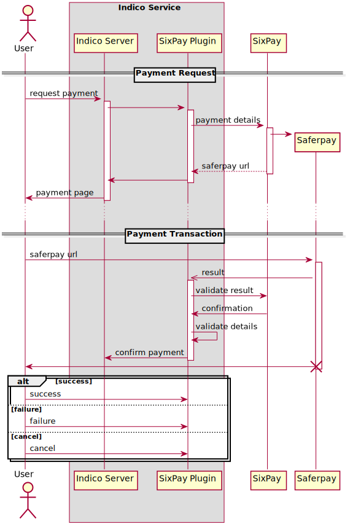

Implementation Overview
=======================

The plugin follows the *Six Payment Services Payment Page*
`Specification Version 5.1 <https://www.six-payment-services.com/dam/classic/saferpay/Saferpay_Payment_Page_EN.pdf>`_.
It implements the *Saferpay https interface* (Section 4 of the Specification),
but has to tie it into the Indico transaction flow.

================= ================================================================= ===============================
HTTP API          Plugin Component                                                  Implementation
================= ================================================================= ===============================
CreatePayInit     :py:class:`~indico_sixpay.plugin.SixpayPaymentPlugin`             ``_get_transaction_parameters``
                                                                                    ``_get_payment_url``
VerifyPayConfirm  :py:class:`~indico_sixpay.request_handlers.SixPayResponseHandler` ``_verify_signature``
CreatePayComplete :py:class:`~indico_sixpay.request_handlers.SixPayResponseHandler` ``_confirm_transaction``
================= ================================================================= ===============================

Payment Procedure
-----------------

See below for an overview of the payment procedure:

