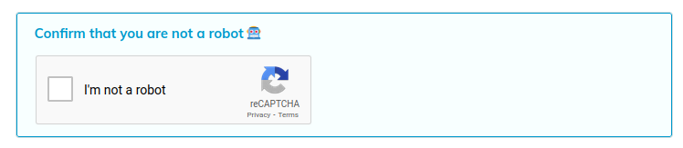

# Google reCAPTCHA Plugin

This plugin replaces the built-in CAPTCHA with Google's reCAPTCHA v2.

This plugin also serves as an example for developers who want to use a
different CAPTCHA for their Indico instance.

## Setup

The plugin requires you to set the reCAPTCHA site key and secret key on the plugin
settings page. These keys can be created on the [reCAPTCHA admin dashboard][recaptcha-create].
Choose **reCAPTCHA v2** and **"I'm not a robot" Checkbox**.

## Changelog

### 3.2

- Initial release for Indico 3.2

[recaptcha-create]: https://www.google.com/recaptcha/admin/create
